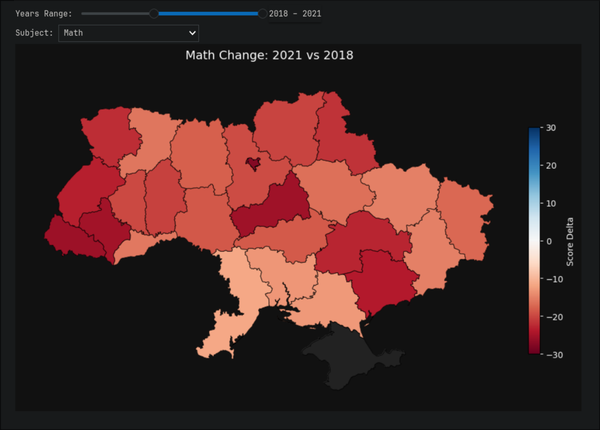
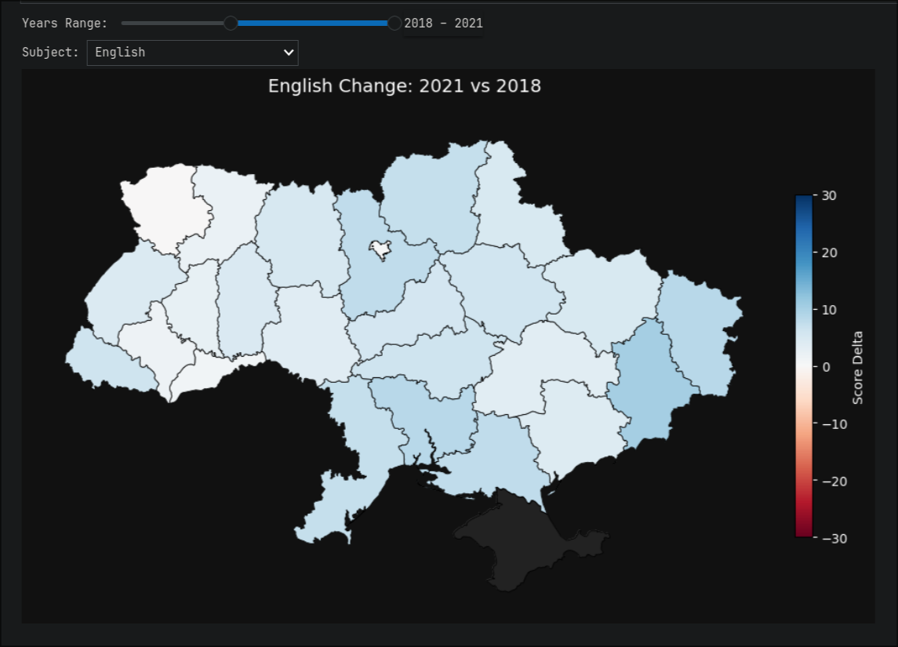
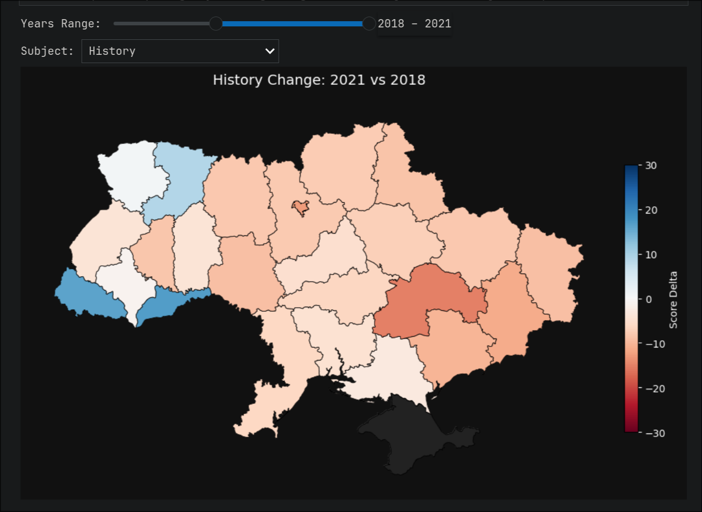
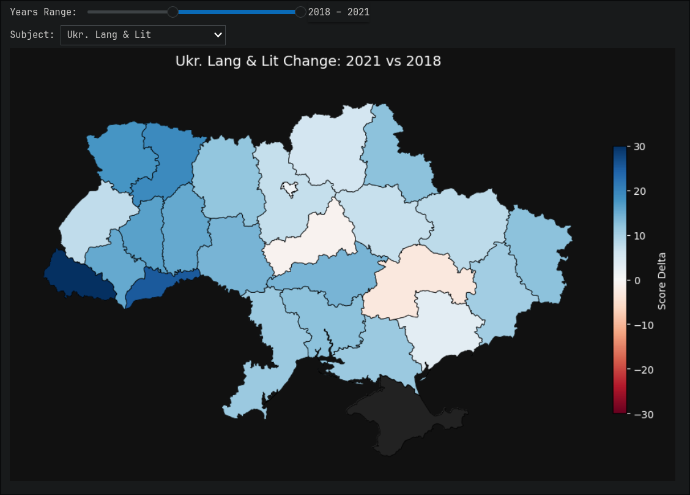
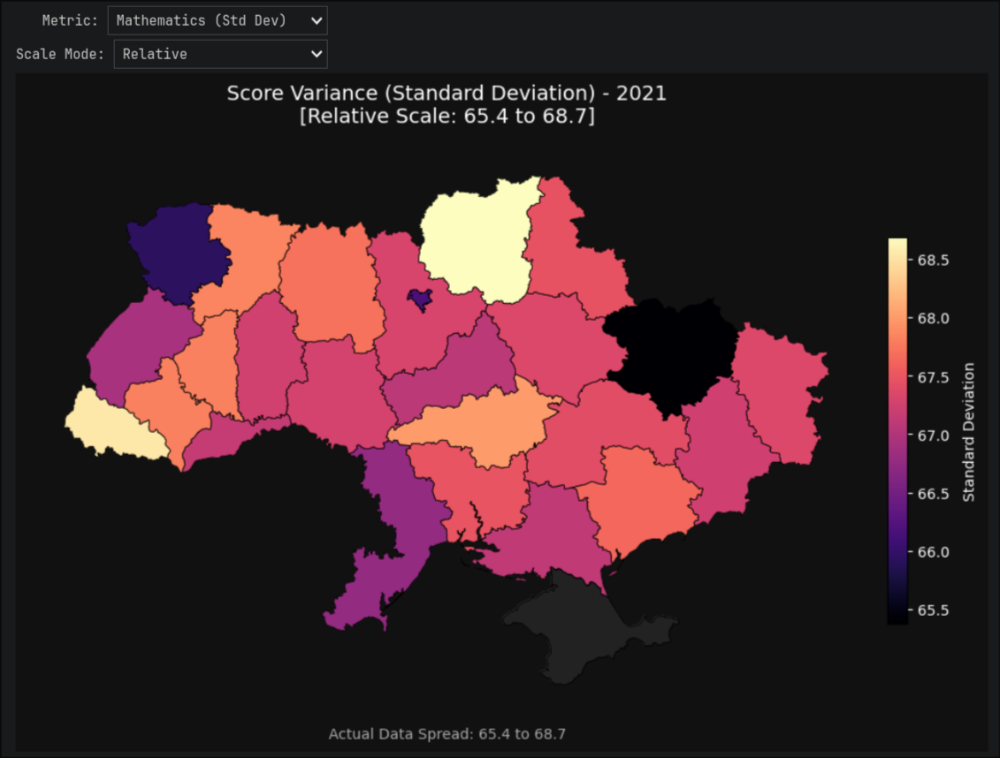
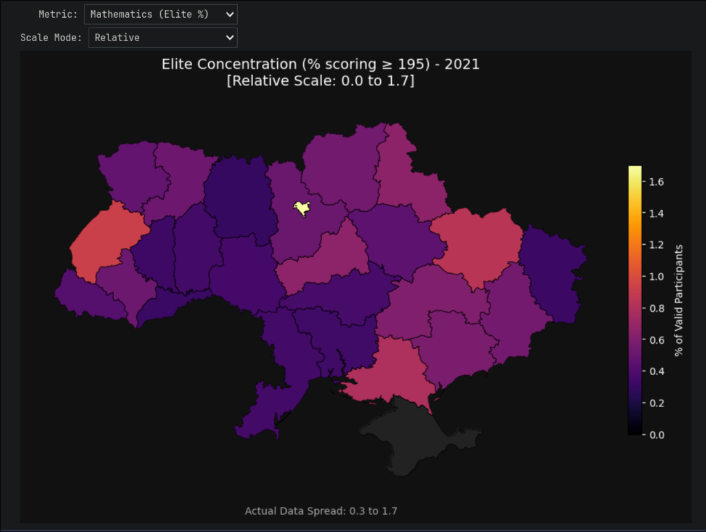
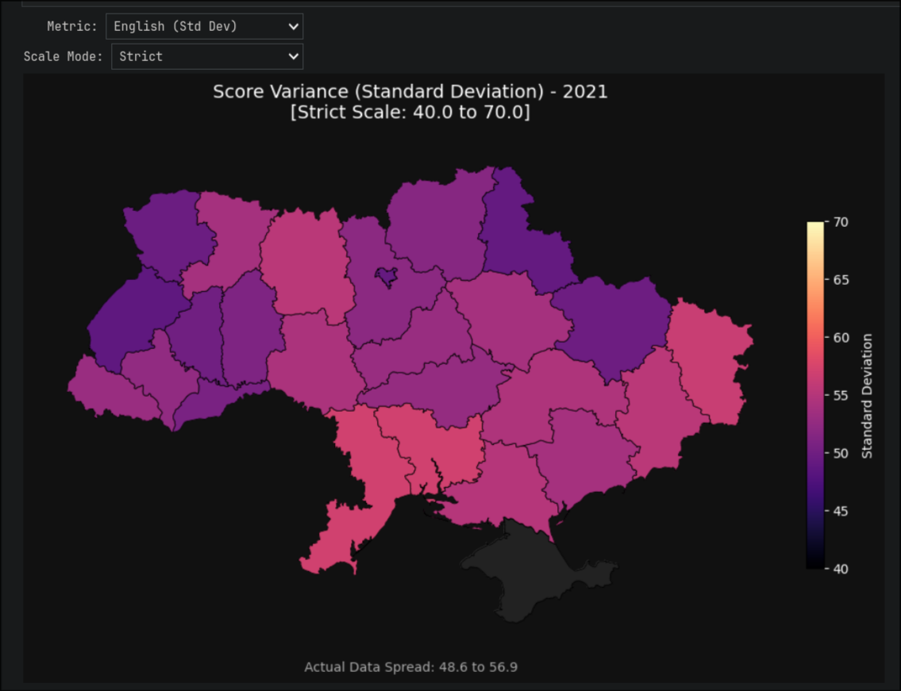
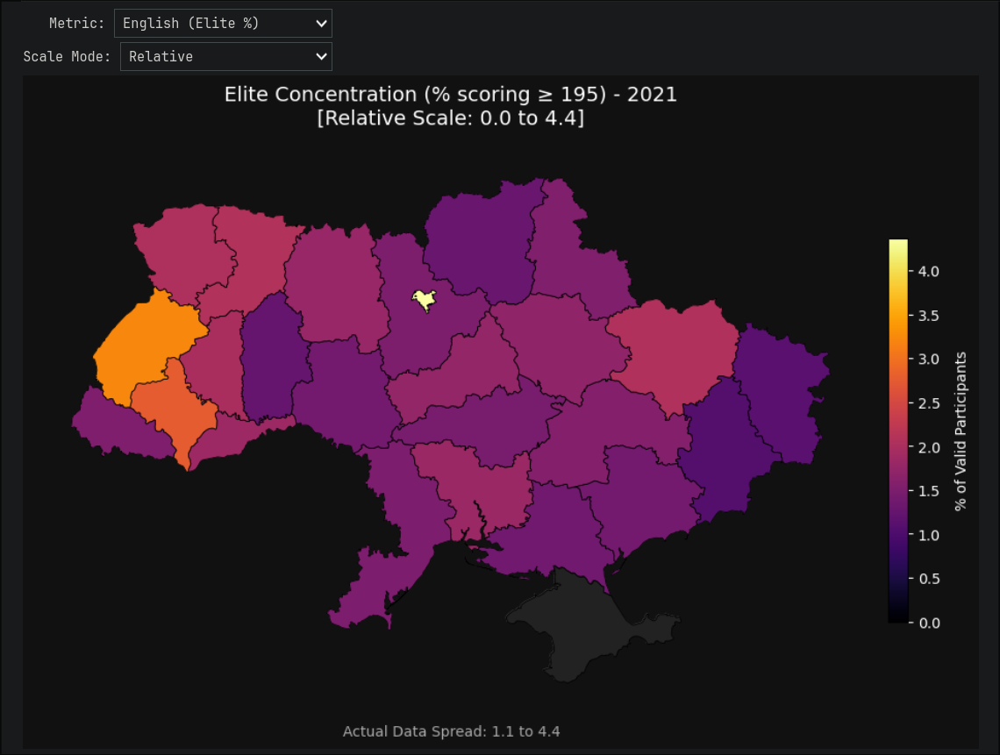

# ZNO Data Analysis (2016-2021)

This repository contains a data analysis of the Ukrainian External Independent Evaluation (ZNO/NMT) open datasets from 2016 to 2021.

The goal is to explore geospatial and temporal trends in educational outcomes across Ukraine, focusing on how systemic changes (like educational reforms and the shift to remote learning) and structural inequalities manifest across different regions and subjects.

## The Data

The analysis uses anonymized, participant-level open data provided by the **Ukrainian Center for Educational Quality Assessment (UCEQA)**.

## Installation & Setup

To run the Jupyter Notebook, ensure you have Python 3 installed along with the following dependencies:

`pip install numpy pandas matplotlib ipywidgets geopandas`

To download datasets, you can run `download.sh` bash script or manually from `zno.testportal.com.ua/opendata site`. Make sure you have `7zz` installed to extract data from archives.

`bash download.sh 2016 2017 2018 2019 2020 2021`

## Visual Results

Below are the key spatial visualizations that illustrate our findings. The maps utilize custom diverging and sequential colormaps to highlight regional disparities.

### Educational Dynamics (Hypothesis 1: 2016 vs 2021)

These maps show the score delta (change in average score) between the first and last available years. Red indicates a decline in performance, while blue indicates improvement.

| Mathematics Score Delta | English Score Delta |
| :---: | :---: |
|  |  |
| *Mathematics shows a universal, nationwide decline (all red).* | *English remains relatively uniform and stable across regions.* |

| History Score Delta | Ukrainian Language Score Delta |
| :---: | :---: |
|  |  |
| *History exhibits a stark regional split (western improvements vs eastern declines).* | *Ukrainian Language shows significant regional variation and overall resilience.* |

---

### Educational Inequality Index (Hypothesis 2: 2021 Snapshot)

These maps isolate the latest year to examine the internal distribution of scores. We compare the overall variance (Standard Deviation) against the concentration of top-tier talent.

| Math Standard Deviation | Math Elite Concentration |
| :---: | :---: |
|  |  |
| *Note the narrow data spread—variance is structurally identical nationwide.* | *The massive spike in Kyiv visually confirms the "Monopoly" on specialized talent.* |

| English Standard Deviation | English Elite Concentration |
| :---: |
|  |  |
| *English shows a tighter overall variance compared to Math, indicating more consistent baseline outcomes.* | *Despite a tighter variance, the highest concentration of top performers remains geographically clustered.* |
